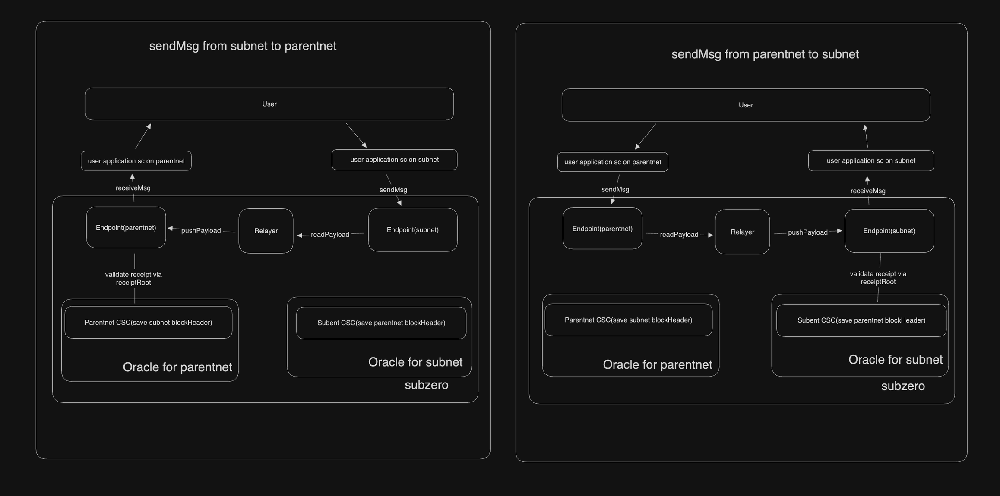

# XDC ZERO: Cross-Chain System 

Elevate blockchain interoperability , ensuring seamless data transmission and validation across diverse chains.

## Table of Contents

- [Core](/core/)
- [Frontend](/frontend/)
- [Relayer](/relayer/)

## Key Components

### Oracle

The Oracle is the backbone of our architecture, facilitating the secure transfer of vital data, especially block headers, between source and target blockchains. Through the utilization of CSC contracts, the system not only ensures robust data transmission but also preserves essential block header information on the target blockchain. This dual-functionality upholds the integrity and consistency of data across chains.

### Relayer

Our Relayer service is the bridge ensuring transactional accuracy. Its primary responsibility is to fetch payload data from the source chain's Endpoint contract and forward it to the target chain's Endpoint contract. Through this, the XDC ZERO system guarantees the accurate and secure transfer of transaction data, enhancing the efficiency of cross-chain interactions.

### Endpoint

The XDC Zero Endpoint acts as the heart of the cross-chain communication process. It's designed to both receive and dispatch data packets across multiple blockchain networks. The functionalities it offers are crucial for the seamless operation of the cross-chain system:

- **Data Reception & Dispatch**: It enables data packets to be accepted from one chain and then relayed or broadcasted to another, ensuring data is always directed to its intended destination.
  
- **Chain Registration**: The Endpoint allows for the recognition and registration of new blockchains within the system. By specifying unique identifiers and associated contracts, it can seamlessly integrate new chains into the cross-chain communication framework.
  
- **Transaction Validation**: Through the Endpoint, transactions can be verified to ensure their legitimacy before being processed. This feature is vital for security and the prevention of malicious activities.
  
- **Payload Retrieval**: The Endpoint provides an interface for applications and services to fetch cross-chain payload data. This is critical for applications that rely on data from other blockchains to function correctly.

In essence, the Endpoint serves as the central hub for all cross-chain data traffic, ensuring that data is accurately received, processed, and dispatched to its correct destination.

